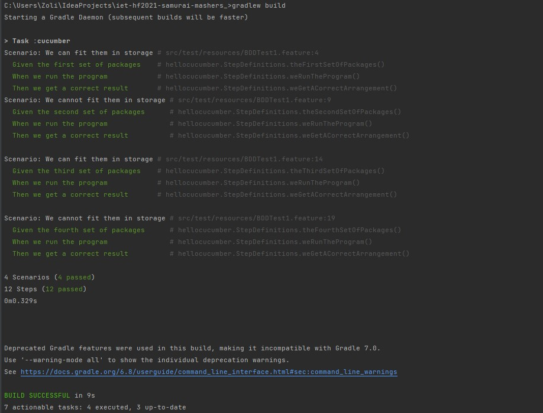
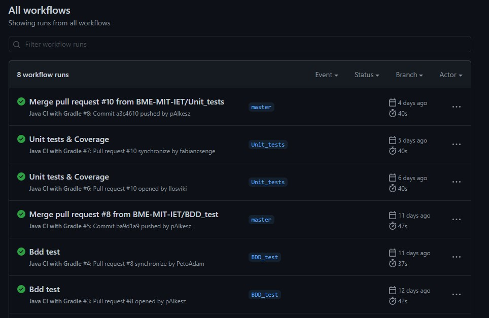

# Setup Gradle build system & Continuous Integration

## Gradle Build system

We needed a robust build system for our project, for handling the building testing, and other various tasks. We chose Gradle, because of several reasons. We found it the most flexible, and easy to use, and also it was the most familiar for most of us. 

After examining a few Gradle project structure, we reorganized the project to make the Gradle integration more seamless. Then I set up Gradle, which needed a few other reorganization in the project, for example, creating the folder structure for the main code and tests. After that, I added the Gradle files, including build.gradle, gradlew and other important files. After that I was able to build and run the project. 

The original Gradle build script only handled the basic build, and run tasks. After we added the cucumber tasks, unit tests, and coverage measuring tools, we had to modify this build script to run these task automatically, when the project is built. The final code of the project that includes all the tests and other tasks, that need to run before build:

```groovy
plugins {
    id 'java'
    id 'jacoco'
}

group 'org.example'
version '1.0-SNAPSHOT'

jacoco {
    toolVersion = "0.8.6"
    reportsDir = file("$buildDir/jacoco")
}

repositories {
    mavenCentral()
}

dependencies {
    testImplementation 'org.junit.jupiter:junit-jupiter-api:5.7.0'
    testImplementation 'io.cucumber:cucumber-java:6.1.1'
    testRuntimeOnly 'org.junit.jupiter:junit-jupiter-engine:5.7.0'
}

test {
    useJUnitPlatform()
    finalizedBy jacocoTestReport // report is always generated after tests run
    jacoco {
        enabled = true
        destinationFile = file("$buildDir/jacoco/test.exec")
        includes = []
        excludes = []
        excludeClassLoaders = []
        includeNoLocationClasses = false
        sessionId = "<auto-generated value>"
        dumpOnExit = true
        classDumpDir = null
        output = JacocoTaskExtension.Output.FILE
        address = "localhost"
        port = 6300
        jmx = false
    }
}
jacocoTestReport {
    dependsOn test // tests are required to run before generating the report
}

configurations {
    cucumberRuntime {
        extendsFrom testImplementation
    }
}

task cucumber() {
    dependsOn assemble, testClasses
    doLast {
        javaexec {
            main = "io.cucumber.core.cli.Main"
            classpath = configurations.cucumberRuntime + sourceSets.main.output + sourceSets.test.output
            args = ['--plugin', 'pretty', '--glue', 'hellocucumber', 'src/test/resources']
        }
    }
}

build.dependsOn cucumber
```

The output of the gradle build command, with successful tests:

 

## Setup continuous integration (GitHub actions)

We needed to setup a continuous integration system to check, if all the new tests work, and we don't mess up previously working parts of the code. We choose GitHub actions, because we already used GitHub as our version control system, and it was easy to integrate into our workflow. It also works really well with Gradle aswell.  I setup the CI to run every time, when there is a push, or merge request to master. I ran a gradle build in a jdk 11 and ubuntu environment, and it runs all the before mentioned various tests.

The action script:

```yaml
name: Java CI with Gradle

on:
  push:
    branches: [ master ]
  pull_request:
    branches: [ master ]

jobs:
  build:

    runs-on: ubuntu-latest

    steps:
    - uses: actions/checkout@v2
    - name: Set up JDK 11
      uses: actions/setup-java@v2
      with:
        java-version: '11'
        distribution: 'adopt'
    - name: Grant execute permission for gradlew
      run: chmod +x gradlew
    - name: Build with Gradle
      run: ./gradlew build
```

The list of previous successful action runs:



## Overall experiences

Both Gradle and CI helped us a lot in the project. It was easier, when we had to change some code, or functionality, because we knew exactly, when did a change break previously working code. We saved a lot of time with the various automation methods, because we knew at both build and merge, when and what exactly went wrong, and could more easily fix it.

