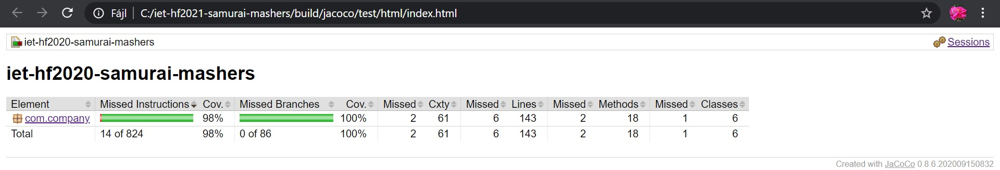
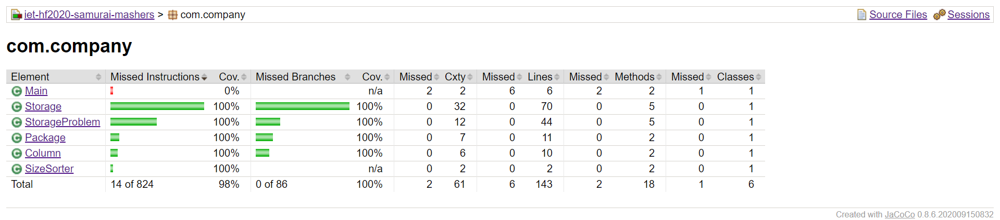
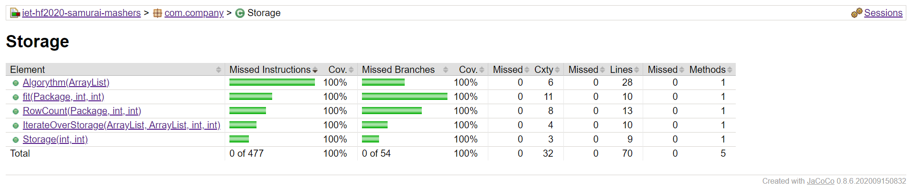
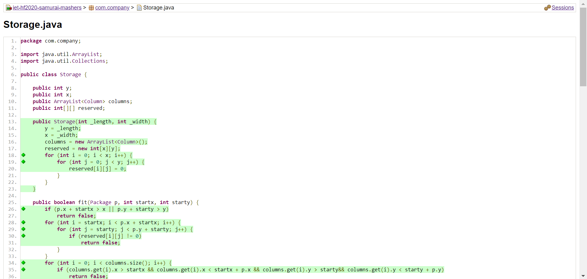

## UNIT TESTS & TEST CODE COVERAGE

# The completed work
First, we refactored some of the methods in the existing code for easier and more precise testing. Then we wrote a couple of basic Unit tests and checked the code coverage with JaCoCo. The results showed that the coverage wasn't high enough yet, so more test writings and refactories were needed. JaCoCo helped us a lot in designing these because of the detailed description it gave us. It showed us which instructions and decision branches weren't tested.

# Results
Test coverages were the following: 
- 98% Instruction Coverage
- 100% Branch Coverage

In this picture we can see the coverages:

If we click on the *com.company* more details will appear about the classes' coverages.

After choosing a class there will be informations about the coverages of every single method.

After the last choice the code will appear. Every line of the instructions will be green (tested), yellow (tested, but not all of the branches tested) or red (not tested).

# Overall experiences
 
When writing Unit tests, we tried to use several Assert functions:
- assertEquals
- assertNotEquals
- assertTrue
- assertFalse

For the asserEquals and assertNotEquals functions, we first encountered the problem that the two objects to be compared were only identical if we actually specified the same object as the expected and calculated value. Thus, for the correct comparison outputs, we had to redefine the equals method for the Package and Column classes. As a result, our two objects became equal when they had the same parameters.

To check for test code coverage, we looked at a number of options, but in the end we opted for JaCoCo as it visually shows us the code coverage. Each line indicates which line of code ran and how many decision branches were tested. This made our job of test writing easier. During the installation we first tried the Maven configuration, but our final choice was the Gradle Configuration. 

We wrote the necessary lines in the build.gradle file to apply the JaCoCo plugin. To get the coverage results, we executed the gradlew test command using the command promt in the project's folder. After all, the results can be found at the following path:
.\iet-hf2021-samurai-mashers\build\jacoco\test\html\index.html