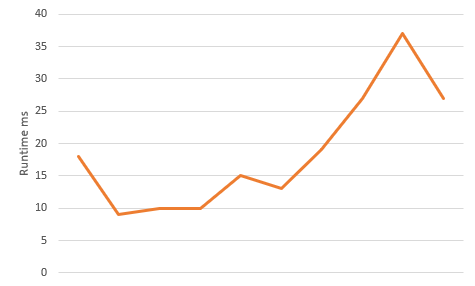

# Non-functional characteristics

## Performance

We ran 10 tests with differing inputs and increasing difficulty.The first test had a really short input and after that each one was a bit longer. We recorder the time it took for 
the program to calculate the output and we produced the following chart:



In these numbers we did not take into consideration the time while the program is waiting for the input. For this we used the following code snippet:

``` java
public static void main(String[] args) {
        StorageProblem problem = new StorageProblem();    
        problem.GetInputFromConsole();   
        long time = System.currentTimeMillis();  
        problem.Solve();   
        problem.PrintStorage();  
        long deltaT = System.currentTimeMillis() - time;  
        System.out.println(deltaT);  
    }
 ```
 
To understand the chart we have to state that the input sizes (or rather the complexity) of the tests not necessarily grow linearly. We tried to implement them so there is not an
exponential growth in complexity between two following tests but we do not have a good measurement to check this. The way we increased the complexity was adding more packages to
a larger storage with more and more columns inside and also adding various package sizes.
 
So on the chart we can see that there is not much difference between shorter and much larger inputs in terms of runtime since the smallest time we measured was around 20 ms and
the largest was around 40 ms. We can see that the longest input's runtime was actually smaller than the one's before. This may be due to to the fact that the CPU was doing
something else in the background during preceeding test or the cause is the actually our program.

## Stresstest

As we could see in the previous paragraph the performance of the program is actually quite good even with more complex inputs. That is why if we run a lot of complex inputs one
after the other, the waiting time for the outputs are little to non-existent so it performs very well under a stresstest. Also it is important to note the the program does not use
any internet connection so there is no other factor that could influence the programs performance under a stresstest.

## Security

## Usability

First of all the most significant issue from a usability point of view is that the program does not have a user interface, it only accepts input through the console. This makes
using the program difficult and slow and it is hard to see what the numbers represent in the input text. Also it is really easy to make a mistake and not notice it and then we will get an invalid output (or no output at all).

The second big issue is that the program does not validate the input it any way. So if we say in the input that we have 5 columns in the storage but we only give the position of four then the program crashes or even worse it gives a wrong output which may go unnoticed by the user. Same thing also applies with packages and their sizes.

During writing the tests we found that in some cases if we give an input with smaller storage capacity then the overall size of the packages, the program might produce an output
which will be incorrect. This could be an issue if a user does not notice it right away.

 
